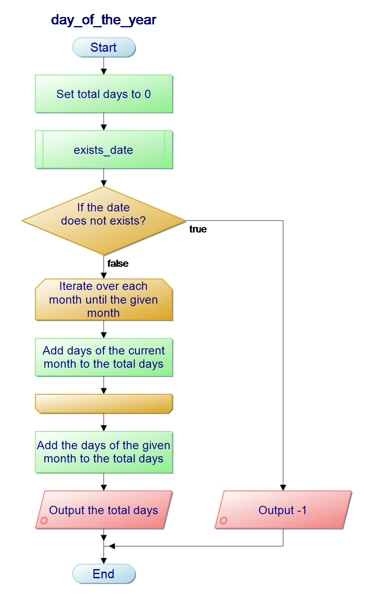

# Documentation

## Table of contents
- [Functions](#functions)
- [Structs](#structs)

### Functions
- [is_leapyear](#int-is_leapyear)
- [exists_date](#int-exists_date)
- [get_days_for_month](#int-get_days_for_month)
- [day_of_the_year](#int-day_of_the_year)
- [input_date](#struct-input_date)

### Structs
- [date](#struct-date)

## Functions

### `int` is_leapyear()
<div align="right">
  <br />
  <p>
    
  </p>
  <br />
</div>

Checks if the given year is a leap year based on the [calendar reform](https://en.wikipedia.org/wiki/Calendar_reform).

|Parameter|Type|Description|
|:--------|:---|:----------|
|year|int|Year to check|

### `int` exists_date()
<div align="right">
  <br />
  <p>
    
  </p>
  <br />
</div>

Validates the given date.

|Parameter|Type|Description|
|:--------|:---|:----------|
|current_date|struct|Date to validate|

### `int` get_days_for_month()
<div align="right">
  <br />
  <p>
    
  </p>
  <br />
</div>

Returns days of the given month (Including leapyears).

|Parameter|Type|Description|
|:--------|:---|:----------|
|month|int|Range from 1 to 12|
|year|int|Range from 1852 to 2400|

### `int` day_of_the_year()
<div align="right">
  <br />
  <p>
    
  </p>
  <br />
</div>

Calculation for the day of the year.

|Parameter|Type|Description|
|:--------|:---|:----------|
|current_date|struct|Date for calculation|

### `struct` input_date()
<div align="right">
  <br />
  <p>
    
  </p>
  <br />
</div>

Reads user date input.

## Structs

### `struct` date
```c
struct date
{
    int day;
    int month;
    int year;
}
```
